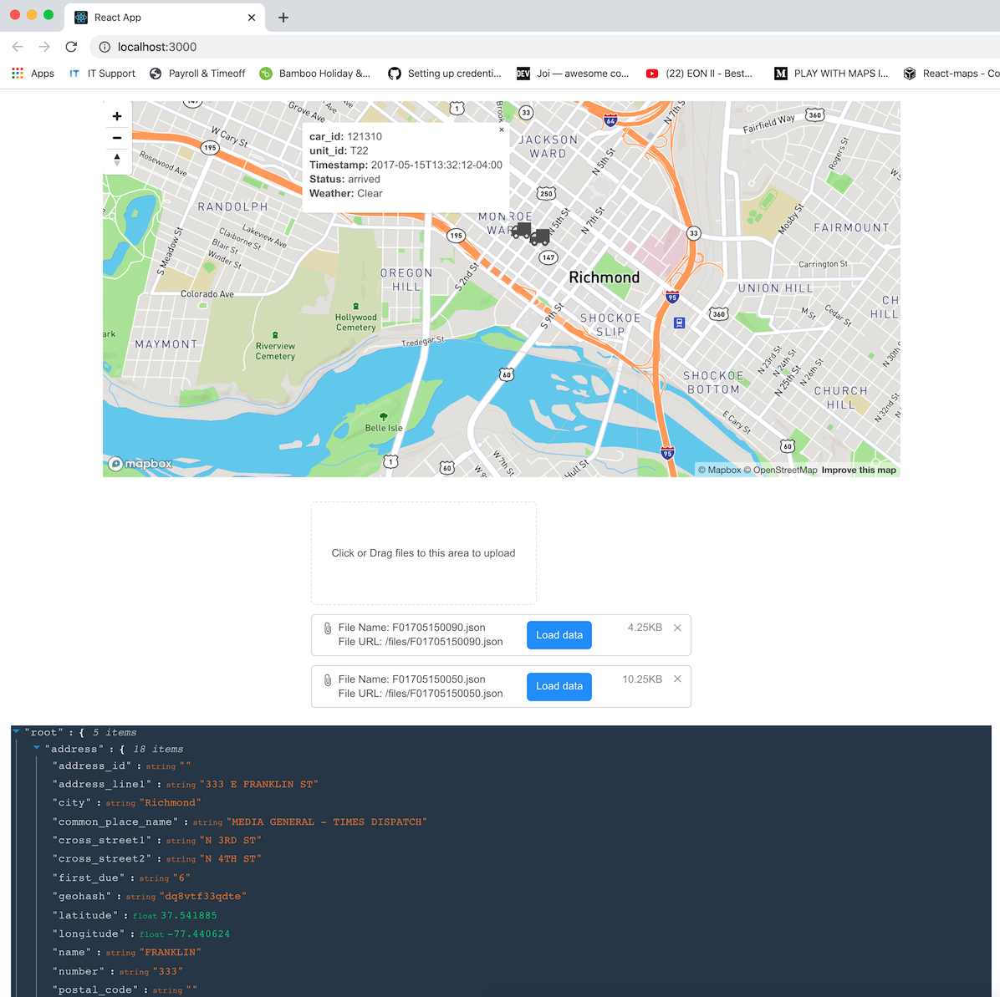

# incident-visualizer



## Installation instructions

#### Prerequisite

| Tool | Link |
| ------ | ------ |
| SDKMAN | https://sdkman.io/ |
| JAVA JDK | https://adoptopenjdk.net/ (use tool like SDKMAN to install: `sdk install java 11.0.3.hs-adpt`) |
| Maven | v3.6+ (`sdk install maven 3.6.3`) |
| Yarn | v1.2+ https://yarnpkg.com/ |

Start Backend first:

```sh
cd backend
mvn spring-boot:run
```

then start Frontend in another terminal:

```sh
cd frontend
yarn install
yarn start
```